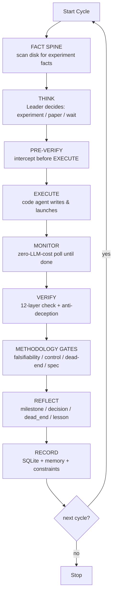

# AutoResearcher

> **An autonomous research agent that actually runs experiments — and is held accountable for every claim of "it worked".**
>
> From a research brief and a dataset to verified results, end-to-end, at PhD level. 24/7.
>
> [English](#why-autores) · [中文](#中文版)

---

## Why AutoResearcher?

Most "AI research" tools either (a) let an LLM write code and trust whatever it says, or (b) do bounded hyperparameter search. **AutoResearcher is neither.** It runs the full research loop — *think → execute → verify → reflect* — but assumes the LLM will cut corners, hallucinate, or quietly swap in fake data. Then it uses **system-level hard constraints** to make that impossible.

**The core idea:** *System = hard constraints, Prompt = research methodology, LLM = PhD brain.* The LLM designs and judges; the system verifies and refuses to be lied to.

### What makes it different

| Capability | AutoResearcher | Deep Research | LangChain agent | AutoML |
|---|:---:|:---:|:---:|:---:|
| Runs real experiments end-to-end | ✅ | ❌ | ⚠️ | ✅ (bounded) |
| **Anti-deception** (facts from tools, not LLM claims) | ✅ | ❌ | ❌ | n/a |
| **Methodology gates** (falsifiable, controlled, no dead-end repeats) | ✅ | ❌ | ❌ | ❌ |
| **12-layer verification** of every result | ✅ | ❌ | ❌ | ⚠️ |
| Learns from failures (dead-end feedback loop) | ✅ | ❌ | ❌ | ⚠️ |
| 24/7 unattended, crash-resilient | ✅ | ❌ | ❌ | ✅ |

### The six pillars

1. **Hard-constraint system** — protected files/dirs, sandboxed `run_python`, ~30 blocked shell patterns (including reverse-shell, pipe-to-shell, PATH tampering), path-escape prevention. The LLM *cannot* overwrite your code or escape the workspace. (`core/tools.py`)
2. **Anti-deception ToolTrace** — every tool call records the *system's real return value*, not the LLM's narration. If the LLM claims "I launched PID 12345" but there's no `launch_experiment` in the trace, it's flagged as deception. (`core/agents.py`)
3. **4 methodology gates** (run before REFLECT, on the FACT layer only — they never reinterpret): *falsifiability* (does the metric actually meet the stated criteria?), *control coverage* (is a causal claim backed by an ablation?), *dead-end signature* (are we retrying a falsified approach?), *spec conformance* (does the code contain the operations it claims to?). (`core/methodology_gates.py`)
4. **12-layer VERIFY** — execution truth, output artifacts, module behavior (not source text), data integrity, metric consistency, config, system health, dataset quality, model structure (AST dead-branch detection), an **independent third-party probe**, analysis coverage, and training-architecture convergence. (`core/verifier.py`)
5. **Zero-cost monitoring + dead-end learning** — training runs are polled without any LLM calls; falsified approaches are recorded and **block retries** after 5 failures (`priority="forbidden"`). (`core/monitor.py`, `core/constraint_engine.py`)
6. **Provider failover** — two-level (model-chain → provider) failover with quota-aware cooldown: a 429 with a reset timestamp is honored absolutely (never retried early), and a hung GLM stream is SIGALRM-killed at 120s. (`core/agents.py`)

---

## Quick Start

### Prerequisites

- **Python 3.10+**
- **At least one LLM API key**: `GLM_CODING_PLAN_API_KEY` (Zhipu, default) or `ALI_TOKEN_PLAN_API_KEY` (Alibaba/Qwen) or `ANTHROPIC_API_KEY` / `OPENAI_API_KEY`
- **GPU optional** — required only if your experiments involve training; analysis-only cycles run fine without one

### Install

```bash
git clone https://github.com/hrf666666/auto-research-agent.git
cd auto-research-agent
pip install -r requirements.txt
```

### Create a project (5-minute example)

```
my_project/
├── PROJECT_BRIEF.md      # REQUIRED — what to research
├── config.yaml           # REQUIRED — copy from repo root, edit
├── data/                 # REQUIRED — your dataset (must be non-empty)
│   └── ...
├── models/               # your model code (nn.Module subclasses)
│   └── ...
└── datasets/             # your data loaders (torch Dataset subclasses)
    └── ...
```

**`PROJECT_BRIEF.md` template:**

```markdown
# Goal
Improve depth estimation on [dataset]. Target: val_MAE < 0.15.

# Codebase
- models/: PyTorch model definitions
- datasets/: Dataset loaders
- data/: training/validation data

# Constraints
- Single GPU (24GB)
- Max 50 epochs per experiment

# Success Criteria
val_MAE on validation set < 0.15
```

See `examples/toy_experiment/` for a runnable MNIST demo, and `examples/single_gpu/README.md` for a full walkthrough.

### Run

```bash
cd my_project

# Set your API key
export GLM_CODING_PLAN_API_KEY="your-key-here"

# Copy and edit config (set workspace to ".")
cp /path/to/auto-research-agent/config.yaml .
# edit: project.name, project.workspace (use "."), goals.metrics

# Run 10 cycles synchronously
python /path/to/auto-research-agent/api.py run --project . --cycles 10

# Or run as a 24/7 background daemon
python /path/to/auto-research-agent/api.py start --project . --gpu 0 --max-cycles -1
python /path/to/auto-research-agent/api.py stop          # stop it
python /path/to/auto-research-agent/api.py status --project .   # check status
```

**Python API:**
```python
from api import AutoResearcher
r = AutoResearcher("/path/to/my_project")
r.run_n_cycles(10)          # synchronous
r.start_daemon(gpu="0", max_cycles=-1)   # background
```

### What you'll see after a run

| Artifact | What it is |
|---|---|
| `workspace/MEMORY_LOG.md` | Human-readable progress — milestones, decisions, dead ends, active problems |
| `autoresearcher.log` | Detailed log — VERIFY results, provider failovers, methodology gates |
| `workspace/experiment_history.db` | Full history (SQLite) — every cycle's metrics, hypotheses, outcomes |
| `workspace/state.json` | Current snapshot — cycle number, status, latest metrics |
| `scripts/train_*.py` | The training scripts the agent wrote (in `scripts/`, never in your `models/`) |

---

## Architecture



The agent runs a **Leader-Worker** architecture: a Leader LLM makes decisions (THINK/REFLECT); specialized worker agents (code, idea, researcher, writing) execute. **Only one worker runs at a time** — the rest cost zero tokens.

**Memory** is 3-tier: `PROJECT_BRIEF.md` (frozen), `MEMORY_LOG.md` (rolling, context-budget-capped ~5000 chars), and `experiment_history.db` (full SQLite history, 7 tables). See `docs/DATA_CONTRACT.md` for the table contract.

👉 Full design deep-dive: **[docs/architecture.md](docs/architecture.md)** (English) · **[docs/architecture_CN.md](docs/architecture_CN.md)** (中文)

---

## Configuration

`config.yaml` key fields (copy from repo root, edit for your project):

```yaml
project:
  name: "my_research"
  workspace: "."          # where artifacts land (use "." for project dir)

goals:
  metrics:                # config-driven targets (replaces hardcoded val_MAE)
    - key: "val_MAE"
      target: 0.15
      direction: "lower"

agent:
  provider: "glm_token_plan"   # glm_token_plan | ali_token_plan | anthropic | openai
  model: "auto"                # auto = task-tier-based selection (strong vs fast)
  max_cycles: -1               # -1 = unlimited (24/7)

monitor:
  poll_interval: 900           # seconds between training polls
  zero_llm: true               # monitoring costs zero LLM tokens

safety:
  mandatory_dry_run: true      # refuse to launch if no dry-run within 10 min
  garbage_collection: true     # deterministic GC each cycle (no LLM cost)
```

---

## Key Features

- **`query_memory` tool** — the LLM actively queries its own experiment history mid-reasoning
- **Methodology gates** — falsifiability + control-coverage + dead-end-signature + spec-conformance
- **Anti-deception** — tool-trace verification means the LLM can't fake "I ran the experiment"
- **Deterministic GC** — archives temp files each cycle, costs no tokens
- **Tool-level safety** — naming enforcement, path sandbox, ~30 blocked shell patterns
- **dead_end feedback loop** — falsified approaches are recorded and block retries (single source of truth in `memory_entries`; see `docs/DATA_CONTRACT.md`)
- **DB read/write contract test** — a test asserts every SQLite table has both a writer and a reader, and every SQL column matches the schema — orphan tables/columns fail the build
- **255+ automated tests**

---

## FAQ

**Q: What if I hit a quota 429 (rate limit)?**
A: AutoResearcher parses the reset timestamp from the error and honors it absolutely — it won't retry until the window resets. If one provider is exhausted, it fails over to the next (GLM → Alibaba/Qwen → Anthropic/OpenAI, whichever you've configured).

**Q: Can it run without a GPU?**
A: Yes for analysis/paper-research cycles. No for training cycles (they launch real PyTorch training). Set `action=paper_research` or `wait` to skip training.

**Q: Does it only support PyTorch?**
A: The agent writes whatever code you ask for, but the VERIFIER's module-checking assumes PyTorch conventions (`nn.Module` / `Dataset` subclasses) for its AST-based validation. Non-PyTorch frameworks work but get less verification coverage.

**Q: How do I redirect the agent if it goes off track?**
A: Write a `DIRECTIVE.md` in the project root. The agent treats it as a human instruction and prioritizes it on the next cycle.

**Q: Is there a Claude Code / Cursor integration?**
A: Yes — `install.py` deploys the agent's skills/prompts into Claude Code, CodeBuddy, or Cursor as slash-commands. Run `python install.py --claude-code` (or `--all`). This is optional; the `api.py` path works standalone.

---

## Limitations (honest)

- **Requires an LLM API key** — there's a cost (mitigated by token-tiering, zero-cost monitoring, and failover)
- **Training needs a GPU** — the core value is the train→verify loop
- **Assumes PyTorch conventions** — the verifier's AST checks look for `nn.Module`/`Dataset`
- **Single worker at a time** — experiments run serially (`max_parallel: 1`); designed for depth, not throughput
- **Default metrics lean visual** — `MAE`/`loss` defaults suit CV/depth-estimation; adapt `goals.metrics` for other domains
- **Optional MCP dependency** — vision analysis and citation exploration use an MCP server (`@z_ai/mcp-server`, needs `npx`)

---

## License

MIT

---

# 中文版

> **一个会真正跑实验、并且为每一句"实验成功了"负责的自主科研 agent。**
>
> 从研究简报和数据集，到经过验证的结果，端到端自主完成，博士生水平。7×24 小时无人值守。

## 为什么是 AutoResearcher？

大多数"AI 科研"工具要么 (a) 让 LLM 写代码然后全盘相信它说的，要么 (b) 在固定的超参空间里搜索。**AutoResearcher 两者都不是。** 它跑完整的研究循环——*思考 → 执行 → 验证 → 反思*——但它**假设 LLM 会偷懒、会幻觉、会偷偷换假数据**，然后用**系统级硬约束**让这些成为不可能。

**核心理念：系统 = 硬约束，指引 = 研究方法论，LLM = 博士生大脑。** LLM 负责设计和判断；系统负责验证，拒绝被骗。

### 六大支柱

1. **硬约束系统** — 受保护文件/目录、沙箱化的 `run_python`、~30 条阻断的 shell 模式（含反弹 shell、管道执行、PATH 篡改）、路径越界防护。LLM **无法**覆盖你的代码或逃出工作区。
2. **反欺骗 ToolTrace** — 每次工具调用都记录**系统的真实返回值**，而非 LLM 的叙述。LLM 说"我启动了 PID 12345"但 trace 里没有 `launch_experiment` 调用 → 判定为欺骗。
3. **4 个方法论门**（在 REFLECT 之前跑，只处理事实层）：*可证伪性*（指标是否真达标？）、*对照覆盖*（因果声明有没有消融实验支撑？）、*死端签名*（是否在重试已被证伪的方向？）、*规格符合*（代码是否真包含声称的操作？）。
4. **12 层 VERIFY** — 执行真相、产物检查、模块行为（不是源码文本）、数据完整性、指标一致性、配置、系统健康、数据集质量、模型结构（AST 死分支检测）、**独立第三方探针**、分析覆盖、训练架构收敛。
5. **零成本监控 + 死端学习** — 训练期间轮询不调 LLM；被证伪的方向会被记录，失败 5 次后**硬阻断重试**（`priority="forbidden"`）。
6. **Provider 故障转移** — 两级（模型链 → provider）故障转移，配额感知冷却：带重置时间戳的 429 被绝对遵守（绝不提前重试），挂起的 GLM 流式调用 120 秒后 SIGALRM 打断。

## 快速开始

### 前置条件
- **Python 3.10+**
- **至少一个 LLM API key**：`GLM_CODING_PLAN_API_KEY`（智谱，默认）或 `ALI_TOKEN_PLAN_API_KEY`（阿里/Qwen）或 `ANTHROPIC_API_KEY` / `OPENAI_API_KEY`
- **GPU 可选** — 只有需要训练的实验才需要

### 安装
```bash
git clone https://github.com/hrf666666/auto-research-agent.git
cd auto-research-agent
pip install -r requirements.txt
```

### 创建项目（5 分钟示例）
```
my_project/
├── PROJECT_BRIEF.md      # 必需 — 研究什么
├── config.yaml           # 必需 — 从仓库根复制并修改
├── data/                 # 必需 — 你的数据集（不能为空）
├── models/               # 你的模型代码（nn.Module 子类）
└── datasets/             # 你的数据加载器（torch Dataset 子类）
```

**`PROJECT_BRIEF.md` 模板：**
```markdown
# 目标
改进 [数据集] 上的深度估计。目标：val_MAE < 0.15。

# 代码库
- models/：PyTorch 模型定义
- datasets/：数据集加载器
- data/：训练/验证数据

# 约束
- 单 GPU（24GB）
- 每个实验最多 50 个 epoch

# 成功标准
验证集 val_MAE < 0.15
```

### 运行
```bash
cd my_project
export GLM_CODING_PLAN_API_KEY="你的key"
cp /path/to/auto-research-agent/config.yaml .   # 编辑 project.workspace 设为 "."

# 同步跑 10 轮
python /path/to/auto-research-agent/api.py run --project . --cycles 10

# 或 7×24 后台守护进程
python /path/to/auto-research-agent/api.py start --project . --gpu 0 --max-cycles -1
python /path/to/auto-research-agent/api.py stop          # 停止
```

完整架构详解：**[docs/architecture_CN.md](docs/architecture_CN.md)**
