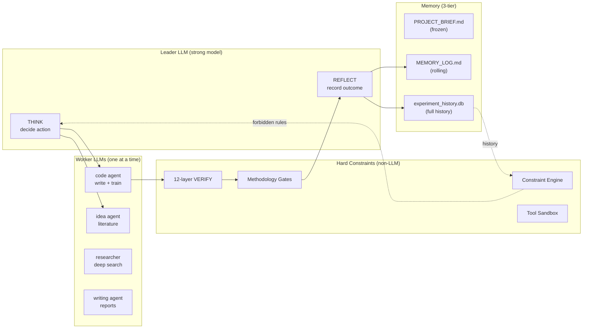
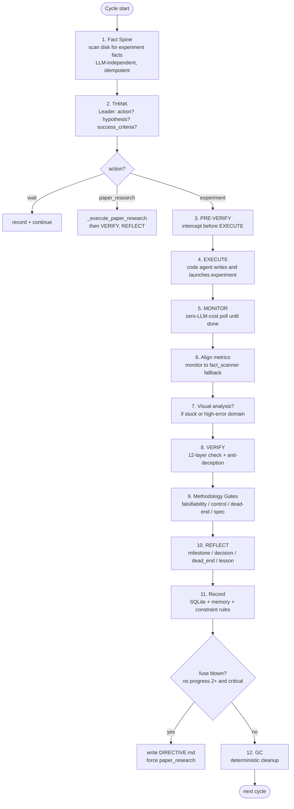
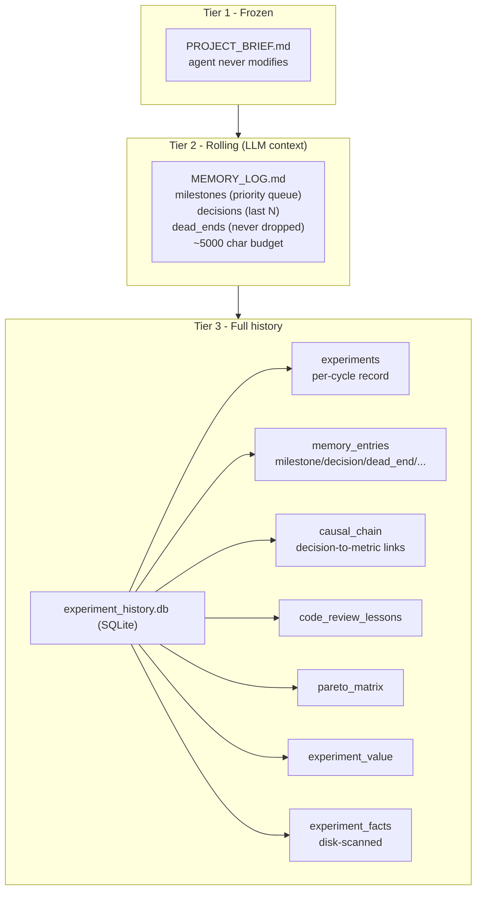
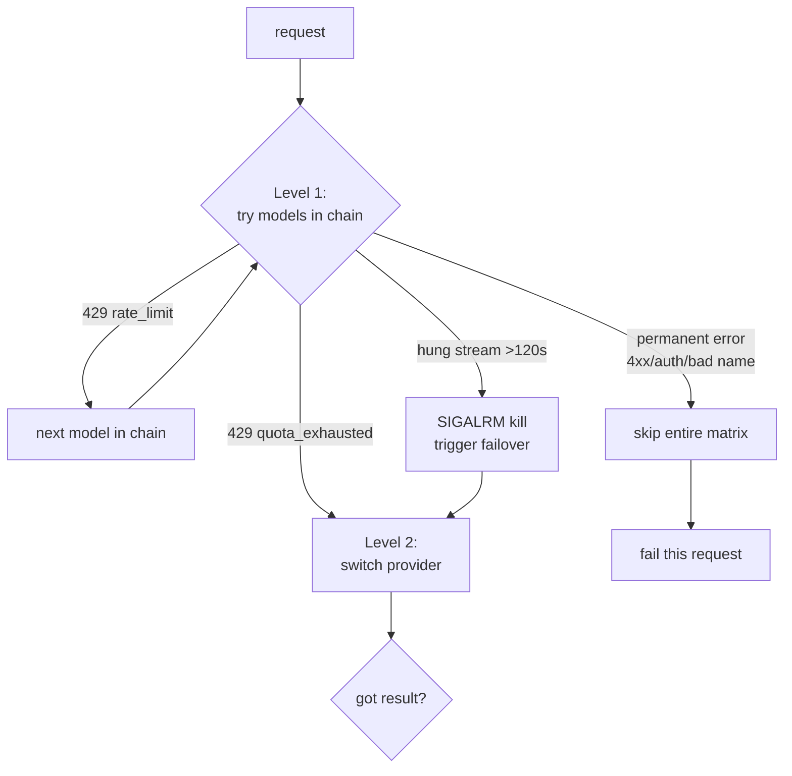

# Architecture

> Deep-dive into how AutoResearcher works. For a quick overview, see the [README](../README.md). For data-table contracts, see [DATA_CONTRACT.md](DATA_CONTRACT.md). 中文版：[architecture_CN.md](architecture_CN.md)

## Table of Contents

1. [Design Philosophy](#1-design-philosophy)
2. [System Overview](#2-system-overview)
3. [The Research Cycle](#3-the-research-cycle)
4. [Multi-Agent Architecture](#4-multi-agent-architecture)
5. [Memory System](#5-memory-system)
6. [Hard Constraints (the soul of the system)](#6-hard-constraints)
7. [Provider & Failover](#7-provider--failover)
8. [File Tree](#8-file-tree)
9. [Configuration Reference](#9-configuration-reference)
10. [Testing](#10-testing)
11. [Appendix: Version History Highlights](#11-appendix-version-history-highlights)

---

## 1. Design Philosophy

Three layers, each with a strict role:

| Layer | Role | Implemented by |
|---|---|---|
| **System = hard constraints** | Safety, lifecycle, tools, memory, methodology — *the LLM cannot bypass these* | `core/tools.py`, `core/verifier.py`, `core/methodology_gates.py` |
| **Prompt = research methodology** | *How* to think (form hypotheses, run controlled experiments, falsify) — not *what* to do | `agents/leader.md`, `agents/code_agent.md`, ... |
| **LLM = PhD brain** | Design, implement, judge, iterate | The model itself (GLM / Qwen / Claude / GPT) |

**One data type, one source of truth.** Each kind of data lives in exactly one place. For example, `dead_end` records exist only in `memory_entries` (`entry_type='dead_end'`), never duplicated across tables. This is enforced by the [L3 contract test](#10-testing).

---

## 2. System Overview



The **Leader** decides what to do and reflects on results. **Workers** execute specialized tasks. The **System** layer enforces constraints the LLM cannot bypass. **Memory** persists across cycles and crash-restarts.

---

## 3. The Research Cycle

One iteration of `ResearchLoop.run()` (`core/loop.py`):



**Key design points:**

- **Crash-resilient**: `cycle_count` is saved at the *start* of each cycle (`loop.py:231`), `state.json` is written atomically (tmp then rename, `loop.py:1378`). A crash resumes from the last saved cycle.
- **Fact Spine first**: before any LLM reasoning, the system scans disk for real experiment facts (`outputs/*/experiment_manifest.json` + `train.log`). This is the ground truth — it survives even if the agent process was killed mid-run.
- **REFLECT fallback is loud**: if REFLECT produces no milestone, the system derives one from facts but labels it `[REFLECT-FAILED]` — never disguising a degradation as success.

---

## 4. Multi-Agent Architecture

**Leader-Worker model** (`core/agents.py`). Only one worker runs at a time; others cost zero tokens.

| Agent | Prompt | max_turns | Tools | Role |
|---|---|---|---|---|
| **Leader** | `leader.md` | 10 (reflect: 20) | log/query_memory, write/read/list_files | THINK + REFLECT decisions |
| **code** | `code_agent.md` | 40 | run_shell, run_python, launch_experiment, diagnose, code_review, probe_model, ... | Implement + train |
| **idea** | `idea_agent.md` | 12 | search_papers, get_paper, write/read | Literature + hypothesis |
| **researcher** | `researcher_agent.md` | 30 | web_search, web_fetch, explore_citations, analyze_image | Deep search + multimodal |
| **writing** | `writing_agent.md` | 30 | write/read/list_files | Reports |

**Dispatch** (`agents.py:513-668`):
- `dispatch_leader(task)` → strong model chain (e.g. GLM: glm-5.2 then 5.1 then 5 ...)
- `dispatch_worker(agent_type)` → code uses fast model; idea/researcher use strong
- **Convergence gate**: code agent loses exploration tools (read/list/search) past 60% of turn budget — forced to converge on launching the experiment.
- **Tool minimization**: each agent gets only 3–6 tools. Fewer tools = fewer tokens in every request.

---

## 5. Memory System

Three tiers, with strictly separated lifetimes:



**The dead_end feedback loop (data flow):**

```
LLM (REFLECT) produces dead_end text
   -> log_dead_end() writes memory_entries (entry_type='dead_end')
   -> get_dead_ends_full() / B9 gate reads it
   -> constraint_engine generates StrategyRule (priority=forbidden after 5 failures)
   -> launch_experiment tool hard-blocks forbidden methods
   -> next THINK cycle sees the block
```

This is a **closed loop**: the agent learns from falsified approaches and is structurally prevented from repeating them. See [DATA_CONTRACT.md](DATA_CONTRACT.md) for the exact write/read contract of every table.

---

## 6. Hard Constraints

The constraints below run in the **tool/fact layer**, not the LLM layer. The LLM cannot talk its way around them.

### 6.1 Tool-level safety (`core/tools.py`)

| Constraint | What it prevents |
|---|---|
| Protected files (`PROJECT_BRIEF.md`, `config.yaml`, `state.json`, ...) | Agent overwriting critical files |
| Protected dirs (`models/`, `datasets/`, `data/`) | Agent corrupting your code |
| `run_python` blacklist (`os.system`, `subprocess`, `eval`, `exec`, `open(...,'w')`) | Arbitrary code execution; includes anti-obfuscation (blocks string concatenation, `chr()`, `getattr(os,...)`) |
| Shell command validation (~30 patterns) | `rm -rf /`, `sudo`, reverse-shell (`nc -e`), pipe-to-shell (`curl ... \| sh`), `mkfifo`, PATH tampering |
| Path sandbox (`_resolve_workspace_path`) | Path traversal / escaping the workspace |
| write_file naming | `train_*.py` must go in `scripts/`; root `.py` forbidden |
| launch_experiment blacklist | infinite loops (`while True`) blocked |
| Mandatory dry-run gate | Refuses to launch training if no dry-run in last 10 min |
| Experiment manifest | `experiment_manifest.json` written on every launch — system-level proof the experiment started |

### 6.2 StrategyConstraintEngine (`core/constraint_engine.py`)

Generates executable rules from history:

- **Hypothesis calibration**: if historical hypothesis accuracy is less than 30% → force "next experiment must cite evidence + propose a falsifiable minimal test"
- **Dead-end rules**: a method recorded as dead-end 3+ times → `priority=high` (warn); 5+ times → `priority=forbidden` (hard block)
- **Pareto frontier**: methods dominated on all domains → blocked

### 6.3 Methodology Gates (`core/methodology_gates.py`)

Run before REFLECT, on **FACT layer only** (numbers, SQL queries, text search). They never reinterpret — "is this really the same dead end?" is left to the LLM.

| Gate | Checks | Prevents |
|---|---|---|
| **G1 Falsifiability** | Parses `success_criteria` into a predicate, queries actual metric, does pure math | LLM claiming "target met" when metric exceeds threshold |
| **G2 Control coverage** | SQL checks `experiment_facts` for ablation/control experiments on causal claims | Uncontrolled causal claims |
| **G3 Dead-end signature** | Matches `method@dataset` signature against recorded dead-ends | Retrying a falsified approach |
| **G4 Spec conformance** | Text-searches code for declared `required_signatures` | Claiming an operation that isn't in the code |

Gates **don't modify** the LLM's chosen action — they attach structured facts to context. But `_record_cycle_outcome` uses G1+G2 for **factual progress gating**: if criteria clearly failed and there is no control → the cycle doesn't count as progress.

### 6.4 Anti-deception (`core/agents.py` ToolTrace)

Every tool call records `{tool_name, args, system_return_value}`. Critical facts (PID, log_file, exit code) are extracted from the **tool return**, never from LLM text.

- **launch_facts extraction**: "I launched PID 12345" but no `launch_experiment` in trace → `deception_detected`
- **VERIFY cross-check**: LLM-text PID vs trace PID mismatch → critical fail
- **Runtime data fingerprint**: the verifier actually imports the dataset and checks if std is constant or spatial autocorrelation is pure noise — detects swapped-in synthetic data
- **Independent probe** (VERIFY Layer 10): a separate code path loads the checkpoint and runs forward — doesn't trust the model's own reported metrics

---

## 7. Provider & Failover

Two-level failover (`core/agents.py`):



**Quota-aware cooldown**: a 429 carrying a reset timestamp (e.g. "resets at 2026-06-15 19:42:06") sets an absolute deadline — the provider is never retried until the window resets. This avoids burning an entire matrix against a permanently-exhausted quota.

**Task tiering**: think/reflect/idea/researcher/code use the strong chain; writing uses the fast chain (and disables "thinking" to save tokens).

---

## 8. File Tree

```
auto_research_agent/
├── api.py                  # CLI + Python API entry point
├── config.yaml             # default config (copy into your project)
├── requirements.txt
├── install.py              # optional: deploy skills into Claude Code / Cursor
│
├── core/                   # the system (hard constraints + loop)
│   ├── loop.py             #   research cycle orchestrator
│   ├── agents.py           #   Leader-Worker dispatch, ToolTrace, failover
│   ├── tools.py            #   tool layer + safety constraints
│   ├── verifier.py         #   12-layer VERIFY
│   ├── methodology_gates.py#   4 methodology gates (fact layer)
│   ├── constraint_engine.py#   rule generation + context pruning
│   ├── memory.py           #   3-tier memory + SQLite
│   ├── monitor.py          #   zero-LLM-cost experiment monitoring
│   ├── fact_scanner.py     #   disk-to-SQLite fact spine
│   ├── training_log_parser.py
│   └── garbage_collector.py
│
├── agents/                 # LLM prompts (research methodology)
│   ├── leader.md           #   THINK + REFLECT prompts
│   ├── code_agent.md       #   implementation + training
│   ├── idea_agent.md       #   literature + hypothesis
│   ├── researcher_agent.md #   deep search
│   └── writing_agent.md
│
├── skills/                 # optional slash-commands for Claude Code / Cursor
├── gpu/                    # GPU detection (used by install.py deployments)
├── tests/                  # 255+ automated tests
├── examples/               # toy_experiment (MNIST), single_gpu guide
└── docs/
    ├── architecture.md     # this file (English)
    ├── architecture_CN.md  # Chinese version
    └── DATA_CONTRACT.md    # SQLite table read/write contract
```

---

## 9. Configuration Reference

| Section | Key fields | Purpose |
|---|---|---|
| `project` | `name`, `brief`, `workspace` | Project identity; `workspace="."` puts artifacts in the project dir |
| `goals.metrics` | `key`, `target`, `direction` | Config-driven targets (replaces hardcoded `val_MAE`) |
| `agent` | `provider`, `model`, `max_cycles`, `max_steps_per_cycle` | LLM provider (`glm_token_plan`/`ali_token_plan`/`anthropic`/`openai`), `model="auto"` for task-tier selection |
| `memory` | `brief_chars`, `log_chars`, `milestone_chars`, `rolling_decisions` | Context-budget caps (keeps LLM context ~5000 chars) |
| `monitor` | `poll_interval`, `max_runtime_hours`, `zero_llm` | Training poll cadence; `zero_llm=true` = no LLM cost during monitoring |
| `gpu` | `auto_detect`, `reserve_last` | GPU selection |
| `sandbox` | `gpu_memory_budget`, `input_shape`, `timeout` | PRE-VERIFY GPU feasibility check |
| `safety` | `mandatory_dry_run`, `naming.forbidden_root_py`, `garbage_collection` | Hard safety switches |
| `multimodal_mcp` | `@z_ai/mcp-server` | Vision analysis + citation exploration (needs `npx`) |

---

## 10. Testing

**255+ automated tests** in `tests/`. Key categories:

| Test file | What it covers |
|---|---|
| `test_db_read_write_contract.py` | **L3 contract test** — asserts every table has a writer + reader, every SQL column exists in DDL; catches orphan tables and column drift |
| `test_tools_security.py` / `test_tool_safety.py` | Sandbox escape attempts, blocked commands, path traversal |
| `test_phase3_gates.py` / `test_phase4_gates.py` | Methodology gates (falsifiability, dead-end, spec) |
| `test_v20_reform.py` / `test_phase2_reform.py` | Reform validation |
| `test_memory_tables.py` | SQLite write then read then consume for 6 tables |
| `test_reflect_parser_fix.py` | REFLECT JSON parsing |
| `test_dispatch_contract.py` | Leader-Worker dispatch contract |
| `test_enforcement.py` | Constraint enforcement |

Run: `python -m pytest tests/ -q`

---

## 11. Appendix: Version History Highlights

This section condenses the design evolution. (Detailed historical docs have been retired — the code is the source of truth.)

- **v1–v10**: Core loop, Leader-Worker, 3-tier memory, anti-deception ToolTrace, 12-layer VERIFY, deterministic GC, provider failover.
- **v11–v13**: Fact spine (`fact_scanner.py` — disk truth survives crashes), code review lessons knowledge base, AST-based model structure scanner (dead-branch detection).
- **v14–v15**: Strategic architecture intelligence, research ROADMAP (module-level state machine).
- **v16.1**: Gate overhaul — methodology gates refactored to FACT-layer-only (never reinterpret), dead module removal, context engineering (tier-based pruning).
- **v17** *(current)*: dead_end data-flow unification (single source of truth in `memory_entries`), orphan table cleanup, L3 anti-regression contract test, `monitor_result` UnboundLocalError fix.
- **v18**: Architecture reform — config-driven metrics, fact-spine milestone fallback, constraint engine hardening.

**Current data-flow health** (see [DATA_CONTRACT.md](DATA_CONTRACT.md)): 4 tables LIVE, 3 tables KNOWN-BROKEN with documented root causes (pareto_matrix, experiment_value, experiment_facts — tracked for separate fix).
