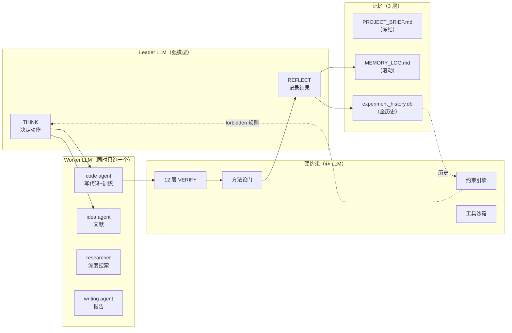
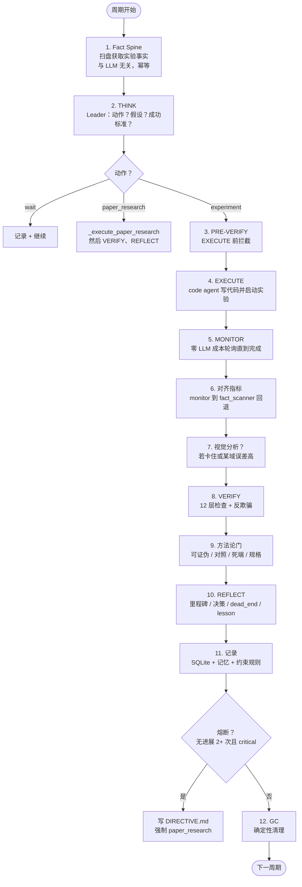
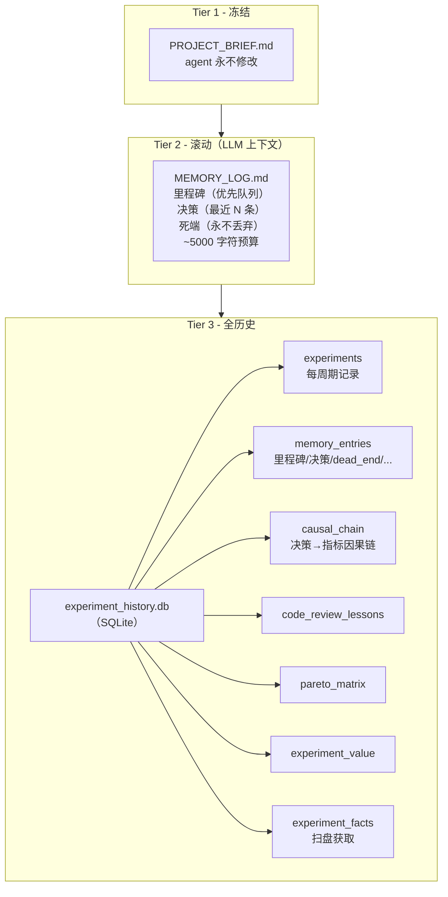
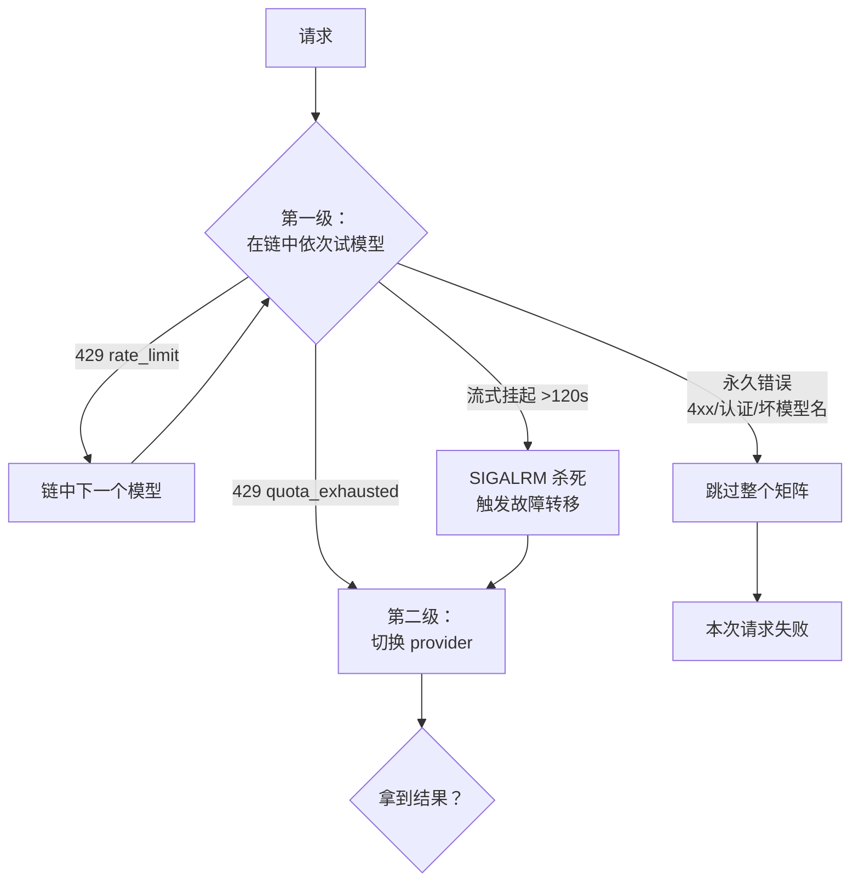

# 架构文档

> AutoResearcher 工作原理详解。快速概览见 [README](../README.md#中文版)。数据表契约见 [DATA_CONTRACT.md](DATA_CONTRACT.md)。English: [architecture.md](architecture.md)

## 目录

1. [设计哲学](#1-设计哲学)
2. [系统总览](#2-系统总览)
3. [研究循环](#3-研究循环)
4. [多 Agent 架构](#4-多-agent-架构)
5. [记忆系统](#5-记忆系统)
6. [硬约束（系统的灵魂）](#6-硬约束系统的灵魂)
7. [Provider 与故障转移](#7-provider-与故障转移)
8. [文件结构](#8-文件结构)
9. [配置参考](#9-配置参考)
10. [测试](#10-测试)
11. [附录：版本演进要点](#11-附录版本演进要点)

---

## 1. 设计哲学

三层架构，各司其职：

| 层 | 角色 | 实现于 |
|---|---|---|
| **系统 = 硬约束** | 安全、生命周期、工具、记忆、方法论 —— *LLM 无法绕过* | `core/tools.py`、`core/verifier.py`、`core/methodology_gates.py` |
| **指引 = 研究方法论** | *怎么*思考（提出假设、做对照实验、证伪）—— 不是 *做什么* | `agents/leader.md`、`agents/code_agent.md`、... |
| **LLM = 博士生大脑** | 设计、实现、判断、迭代 | 模型本身（GLM / Qwen / Claude / GPT） |

**一类数据，一个真相源。** 每种数据只存在一个地方。例如 `dead_end` 记录只存在于 `memory_entries`（`entry_type='dead_end'`），绝不在多张表里重复。这由 [L3 契约测试](#10-测试)强制保证。

---

## 2. 系统总览



**Leader** 决定做什么、反思结果。**Worker** 执行专门任务。**系统层**强制执行 LLM 无法绕过的约束。**记忆**跨周期持久化，崩溃后可恢复。

---

## 3. 研究循环

`ResearchLoop.run()`（`core/loop.py`）的一次迭代：



**关键设计点：**

- **崩溃可恢复**：`cycle_count` 在每个周期*开始时*就保存（`loop.py:231`），`state.json` 原子写入（先 tmp 再 rename，`loop.py:1378`）。崩溃后从上次保存的周期续跑。
- **Fact Spine 优先**：在任何 LLM 推理之前，系统先扫盘获取真实实验事实（`outputs/*/experiment_manifest.json` + `train.log`）。这是基准真相——即使 agent 进程在运行中被杀，它也存活。
- **REFLECT 兜底要响亮**：如果 REFLECT 没产出里程碑，系统会从事实中推导一个，但标记为 `[REFLECT-FAILED]`——绝不把降级伪装成成功。

---

## 4. 多 Agent 架构

**Leader-Worker 模式**（`core/agents.py`）。同时只有一个 worker 运行，其余零 token 成本。

| Agent | Prompt | max_turns | 工具 | 角色 |
|---|---|---|---|---|
| **Leader** | `leader.md` | 10（reflect: 20） | log/query_memory、write/read/list_files | THINK + REFLECT 决策 |
| **code** | `code_agent.md` | 40 | run_shell、run_python、launch_experiment、diagnose、code_review、probe_model、... | 实现 + 训练 |
| **idea** | `idea_agent.md` | 12 | search_papers、get_paper、write/read | 文献 + 假设 |
| **researcher** | `researcher_agent.md` | 30 | web_search、web_fetch、explore_citations、analyze_image | 深度搜索 + 多模态 |
| **writing** | `writing_agent.md` | 30 | write/read/list_files | 报告 |

**调度**（`agents.py:513-668`）：
- `dispatch_leader(task)` → 强模型链（如 GLM：glm-5.2 → 5.1 → 5 ...）
- `dispatch_worker(agent_type)` → code 用快模型；idea/researcher 用强模型
- **收敛门**：code agent 超过 60% turn 预算后，禁用探索工具（read/list/search）——强制收敛到启动实验。
- **工具最小化**：每个 agent 只有 3–6 个工具。工具越少 = 每次请求的 token 越少。

---

## 5. 记忆系统

三层，生命周期严格分离：



**dead_end 反馈回路（数据流）：**

```
LLM（REFLECT）产出 dead_end 文本
   -> log_dead_end() 写入 memory_entries（entry_type='dead_end'）
   -> get_dead_ends_full() / B9 门读取
   -> constraint_engine 生成 StrategyRule（失败 5 次后 priority=forbidden）
   -> launch_experiment 工具硬阻断 forbidden 方法
   -> 下一个 THINK 周期看到阻断
```

这是一个**闭环**：agent 从被证伪的方向中学习，并在结构上被阻止重复它们。每张表的精确读写契约见 [DATA_CONTRACT.md](DATA_CONTRACT.md)。

---

## 6. 硬约束（系统的灵魂）

下面的约束运行在**工具/事实层**，不是 LLM 层。LLM 无法靠嘴遁绕过它们。

### 6.1 工具层安全（`core/tools.py`）

| 约束 | 防止什么 |
|---|---|
| 受保护文件（`PROJECT_BRIEF.md`、`config.yaml`、`state.json`、...） | agent 覆盖关键文件 |
| 受保护目录（`models/`、`datasets/`、`data/`） | agent 损坏你的代码 |
| `run_python` 黑名单（`os.system`、`subprocess`、`eval`、`exec`、`open(...,'w')`） | 任意代码执行；含反混淆（阻断字符串拼接、`chr()`、`getattr(os,...)`） |
| shell 命令校验（~30 条模式） | `rm -rf /`、`sudo`、反弹 shell（`nc -e`）、管道执行（`curl ... \| sh`）、`mkfifo`、PATH 篡改 |
| 路径沙箱（`_resolve_workspace_path`） | 路径穿越 / 逃出工作区 |
| write_file 命名 | `train_*.py` 必须放 `scripts/`；根目录禁止写 `.py` |
| launch_experiment 黑名单 | 无限循环（`while True`）阻断 |
| 强制 dry-run 门 | 10 分钟内无 dry-run 则拒绝启动训练 |
| 实验清单 | 每次启动写 `experiment_manifest.json`——实验确实启动的系统级证据 |

### 6.2 StrategyConstraintEngine（`core/constraint_engine.py`）

从历史生成可执行规则：

- **假设校准**：如果历史假设准确率低于 30% → 强制"下次实验必须引用证据 + 提出可证伪的最小测试"
- **死端规则**：某方法被记为死端 3+ 次 → `priority=high`（警告）；5+ 次 → `priority=forbidden`（硬阻断）
- **Pareto 前沿**：在所有域上都被支配的方法 → 阻断

### 6.3 方法论门（`core/methodology_gates.py`）

在 REFLECT 之前跑，**只处理事实层**（数字、SQL 查询、文本搜索）。它们绝不重新解释——"这是否真的是同一个死端？"留给 LLM 判断。

| 门 | 检查 | 防止什么 |
|---|---|---|
| **G1 可证伪性** | 把 `success_criteria` 解析成谓词，查询实际指标，做纯数学比较 | LLM 声称"达标"但指标实际超标 |
| **G2 对照覆盖** | SQL 查 `experiment_facts` 是否有因果声明对应的消融/对照实验 | 无对照的因果声明 |
| **G3 死端签名** | 用 `method@dataset` 签名匹配已记录的死端 | 重试已被证伪的方向 |
| **G4 规格符合** | 文本搜索代码是否包含声明的 `required_signatures` | 声称做了某操作但代码里没有 |

门**不修改** LLM 选择的动作——它们把结构化事实挂到上下文。但 `_record_cycle_outcome` 用 G1+G2 做**事实进度门控**：如果标准明确失败且无对照 → 这个周期不计为进展。

### 6.4 反欺骗（`core/agents.py` ToolTrace）

每次工具调用都记录 `{tool_name, args, system_return_value}`。关键事实（PID、log_file、exit code）从**工具返回值**提取，绝不从 LLM 文本提取。

- **launch_facts 提取**："我启动了 PID 12345"但 trace 里没有 `launch_experiment` → `deception_detected`
- **VERIFY 交叉校验**：LLM 文本 PID vs trace PID 不一致 → critical 失败
- **运行时数据指纹**：verifier 实际 import 数据集，检查 std 是否常数、空间自相关是否纯噪声——检测偷偷换入的合成数据
- **独立探针**（VERIFY 第 10 层）：用独立代码路径加载 checkpoint 跑 forward——不信任模型自己报告的指标

---

## 7. Provider 与故障转移

两级故障转移（`core/agents.py`）：



**配额感知冷却**：带重置时间戳的 429（如"将在 2026-06-15 19:42:06 重置"）会设置一个绝对截止时间——在窗口重置前绝不重试该 provider。避免对着永久耗尽的配额烧掉整个矩阵。

**任务分层**：think/reflect/idea/researcher/code 用强链；writing 用快链（并关闭"思考"省 token）。

---

## 8. 文件结构

```
auto_research_agent/
├── api.py                  # CLI + Python API 入口
├── config.yaml             # 默认配置（复制到你的项目里）
├── requirements.txt
├── install.py              # 可选：把 skills 部署到 Claude Code / Cursor
│
├── core/                   # 系统（硬约束 + 循环）
│   ├── loop.py             #   研究循环编排器
│   ├── agents.py           #   Leader-Worker 调度、ToolTrace、故障转移
│   ├── tools.py            #   工具层 + 安全约束
│   ├── verifier.py         #   12 层 VERIFY
│   ├── methodology_gates.py#   4 个方法论门（事实层）
│   ├── constraint_engine.py#   规则生成 + 上下文裁剪
│   ├── memory.py           #   3 层记忆 + SQLite
│   ├── monitor.py          #   零 LLM 成本实验监控
│   ├── fact_scanner.py     #   扫盘→SQLite 事实脊柱
│   ├── training_log_parser.py
│   └── garbage_collector.py
│
├── agents/                 # LLM 指引（研究方法论）
│   ├── leader.md           #   THINK + REFLECT 指引
│   ├── code_agent.md       #   实现 + 训练
│   ├── idea_agent.md       #   文献 + 假设
│   ├── researcher_agent.md #   深度搜索
│   └── writing_agent.md
│
├── skills/                 # 可选的 Claude Code / Cursor 斜杠命令
├── gpu/                    # GPU 检测（install.py 部署时用）
├── tests/                  # 255+ 自动化测试
├── examples/               # toy_experiment（MNIST）、single_gpu 指南
└── docs/
    ├── architecture.md     # 本文件（中文）
    ├── architecture.md     # 英文版
    └── DATA_CONTRACT.md    # SQLite 表读写契约
```

---

## 9. 配置参考

| 段 | 关键字段 | 用途 |
|---|---|---|
| `project` | `name`、`brief`、`workspace` | 项目标识；`workspace="."` 让产物落在项目目录 |
| `goals.metrics` | `key`、`target`、`direction` | 配置驱动的目标（替代硬编码 `val_MAE`） |
| `agent` | `provider`、`model`、`max_cycles`、`max_steps_per_cycle` | LLM provider（`glm_token_plan`/`ali_token_plan`/`anthropic`/`openai`），`model="auto"` 按任务分层选模型 |
| `memory` | `brief_chars`、`log_chars`、`milestone_chars`、`rolling_decisions` | 上下文预算上限（保持 LLM 上下文 ~5000 字符） |
| `monitor` | `poll_interval`、`max_runtime_hours`、`zero_llm` | 训练轮询间隔；`zero_llm=true` = 监控期间无 LLM 成本 |
| `gpu` | `auto_detect`、`reserve_last` | GPU 选择 |
| `sandbox` | `gpu_memory_budget`、`input_shape`、`timeout` | PRE-VERIFY GPU 可行性检查 |
| `safety` | `mandatory_dry_run`、`naming.forbidden_root_py`、`garbage_collection` | 硬安全开关 |
| `multimodal_mcp` | `@z_ai/mcp-server` | 视觉分析 + 引文探索（需 `npx`） |

---

## 10. 测试

**255+ 自动化测试**，在 `tests/`。主要类别：

| 测试文件 | 覆盖什么 |
|---|---|
| `test_db_read_write_contract.py` | **L3 契约测试**——断言每张表都有写者+读者，每个 SQL 列在 DDL 中存在；抓孤儿表和列漂移 |
| `test_tools_security.py` / `test_tool_safety.py` | 沙箱逃逸、阻断的命令、路径穿越 |
| `test_phase3_gates.py` / `test_phase4_gates.py` | 方法论门（可证伪、死端、规格） |
| `test_v20_reform.py` / `test_phase2_reform.py` | 改革验证 |
| `test_memory_tables.py` | 6 张表的 写→读→消费 |
| `test_reflect_parser_fix.py` | REFLECT JSON 解析 |
| `test_dispatch_contract.py` | Leader-Worker 调度契约 |
| `test_enforcement.py` | 约束强制执行 |

运行：`python -m pytest tests/ -q`

---

## 11. 附录：版本演进要点

本节精炼了设计演进。（详细历史文档已停用——代码是真相源。）

- **v1–v10**：核心循环、Leader-Worker、3 层记忆、反欺骗 ToolTrace、12 层 VERIFY、确定性 GC、provider 故障转移。
- **v11–v13**：Fact spine（`fact_scanner.py`——磁盘真相抗崩溃）、code review lessons 知识库、基于 AST 的模型结构扫描（死分支检测）。
- **v14–v15**：战略性架构智能、研究 ROADMAP（模块级状态机）。
- **v16.1**：门控大修——方法论门重构为仅事实层（绝不重新解释）、死模块移除、上下文工程（分层裁剪）。
- **v17**（*当前*）：dead_end 数据流统一（`memory_entries` 单一真相源）、孤儿表清理、L3 防回归契约测试、`monitor_result` UnboundLocalError 修复。
- **v18**：架构改革——配置驱动指标、fact-spine 里程碑兜底、约束引擎加固。

**当前数据流健康度**（见 [DATA_CONTRACT.md](DATA_CONTRACT.md)）：4 张表 LIVE，3 张表 KNOWN-BROKEN（有文档化根因：pareto_matrix、experiment_value、experiment_facts——待单独修复）。
